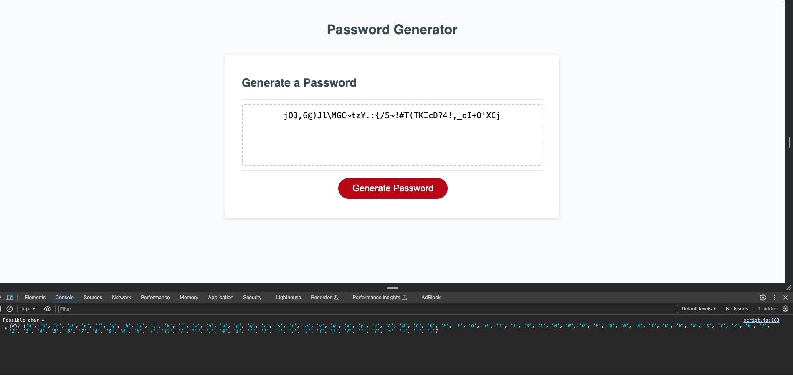

# Password Generator
An online web application that generates the user a unique password based on input criteria.
## Description
In this project we were tasked with creating a web application that issues a series of prompts to the user in order to generate them a unique password based on the selected criteria.

This project was built utilising Javascript functions.
## Installation
The application requires no installation as it is a live webpage.
## Usage
To utilise this application you can visit the webpage by following this URL:

 https://harrynewt0n.github.io/password-generator-challenge/

This should open up at webpage that looks like this: 

Click on the 'Generate Password' button and follow the on screen prompts until the application generates a unique password based on your input criteria.
## Credits
N/A
## License
MIT License

Copyright (c) 2024 harrynewt0n

Permission is hereby granted, free of charge, to any person obtaining a copy
of this software and associated documentation files (the "Software"), to deal
in the Software without restriction, including without limitation the rights
to use, copy, modify, merge, publish, distribute, sublicense, and/or sell
copies of the Software, and to permit persons to whom the Software is
furnished to do so, subject to the following conditions:

The above copyright notice and this permission notice shall be included in all
copies or substantial portions of the Software.

THE SOFTWARE IS PROVIDED "AS IS", WITHOUT WARRANTY OF ANY KIND, EXPRESS OR
IMPLIED, INCLUDING BUT NOT LIMITED TO THE WARRANTIES OF MERCHANTABILITY,
FITNESS FOR A PARTICULAR PURPOSE AND NONINFRINGEMENT. IN NO EVENT SHALL THE
AUTHORS OR COPYRIGHT HOLDERS BE LIABLE FOR ANY CLAIM, DAMAGES OR OTHER
LIABILITY, WHETHER IN AN ACTION OF CONTRACT, TORT OR OTHERWISE, ARISING FROM,
OUT OF OR IN CONNECTION WITH THE SOFTWARE OR THE USE OR OTHER DEALINGS IN THE
SOFTWARE.